# Final-Year-Project -> Title: Let's Contruct
A website design which got designed depending upon idea related to construction work. Design is based upon Mongodb, React Js, Express Js and Node Js. 

# Idea / Plan Description:
The idea was to create a platform to give access to users to order workers, construction related goods, getting plans related to construction  or to get estimate about the cost required for the construction related work of any size. For this plan 3 kind of users got designed, 
1) Customer - Who have access to place orders
2) Workers - Who can get order related to the works. But user-worker is also classified into three classes
   1) Single Worker ( Having no team / contractor ).
   2) Teamed Workers ( Team of workers but having no contractor ).
   3) Contractor ( A person with a team of workers under him ).
3) Product Dealers - Who can get  orders related to the products he uploaded as a sale feature of his id.

Each kind of the user can create his own id and have a different web designed view for all. For the customers right now there is an option to place orders depending upon the need or requirements. And user-worker or user-dealer there are option for accepting the order or cancelling the order. All the new/accepted/completed orders are having seperate list view to display them to the user.

# Screens Display:

1) Main page - Right having only sign in/ sign up options for the users not giving direct access to any kind of user:
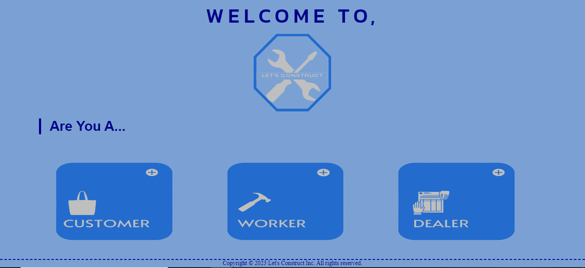

2) Customer's Subpages:
   1) SignIn/SignUp:
      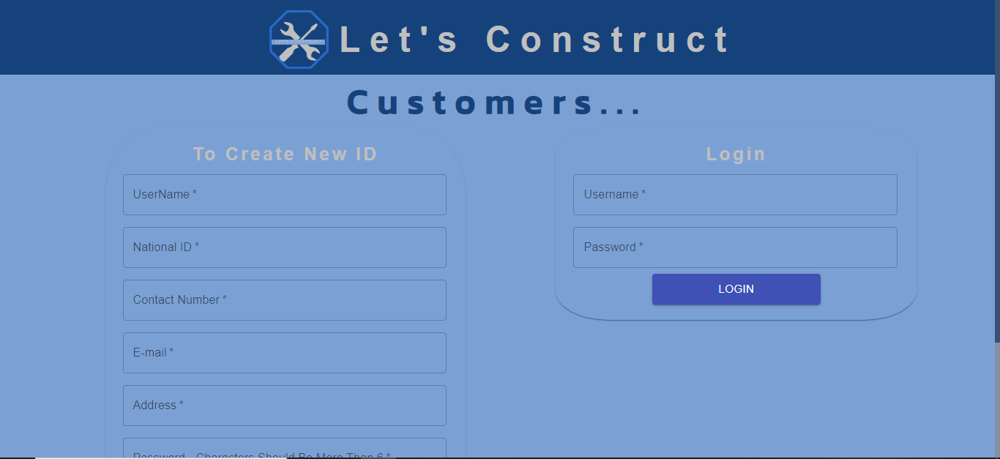
      
   3) Home Page:
      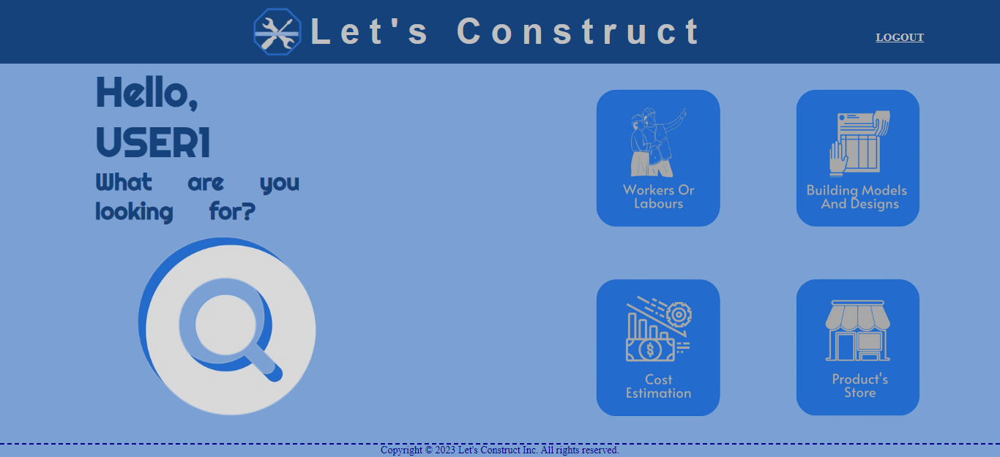

   4) Labors/Workers:
      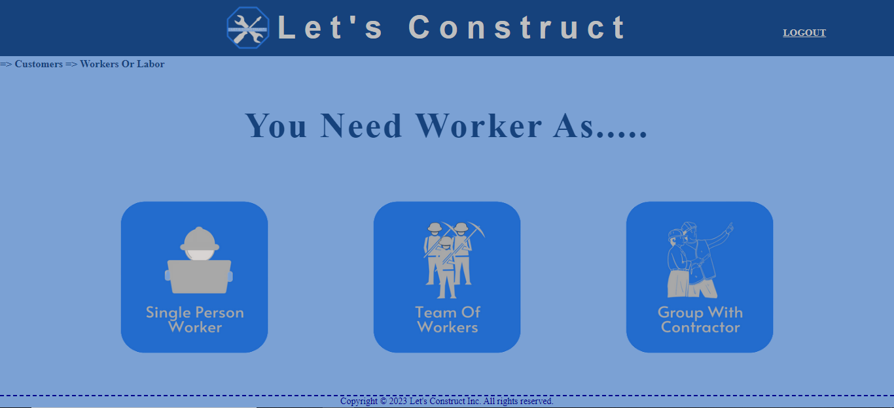 If selected single worker: 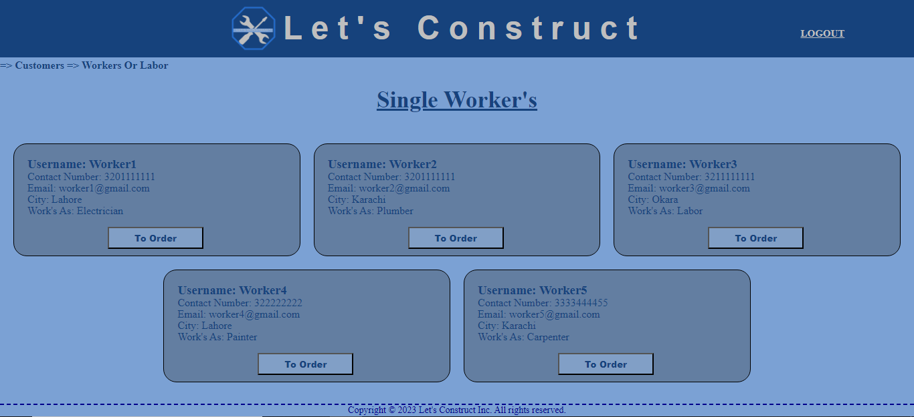
 If selected teamed workers:  If selected contractor: 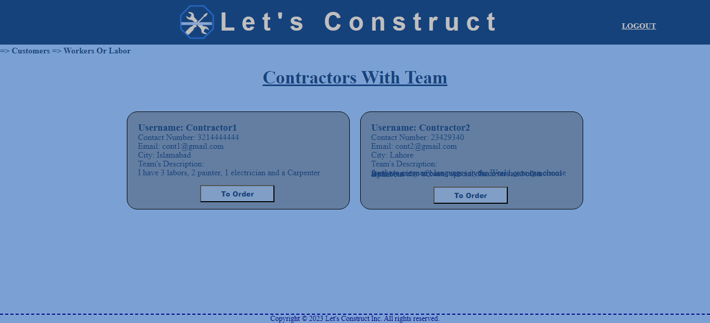

   5) Building Models:
      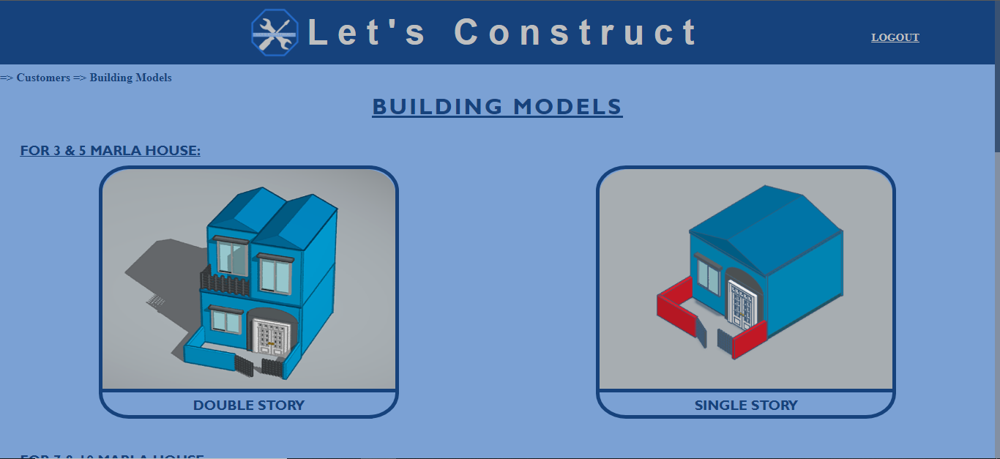
      
   7) Cost Estimation:
      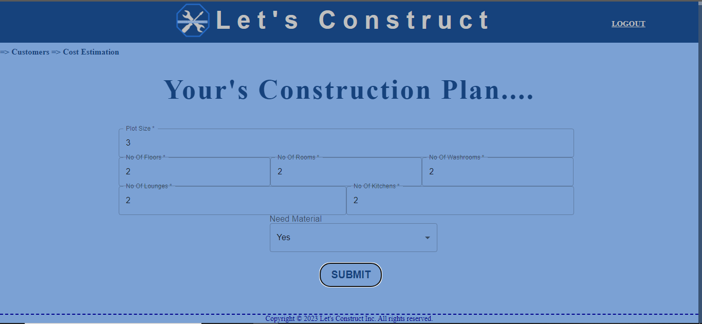 Example: 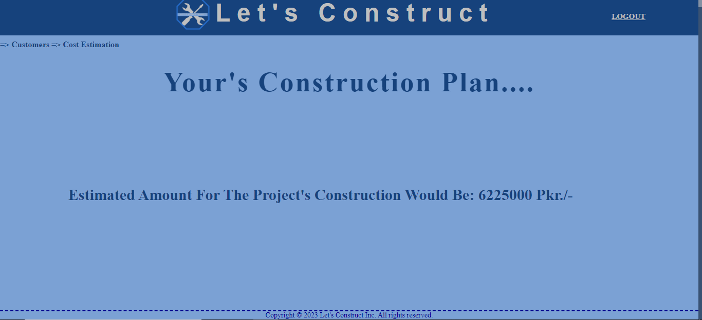

   8) Product's Store:
      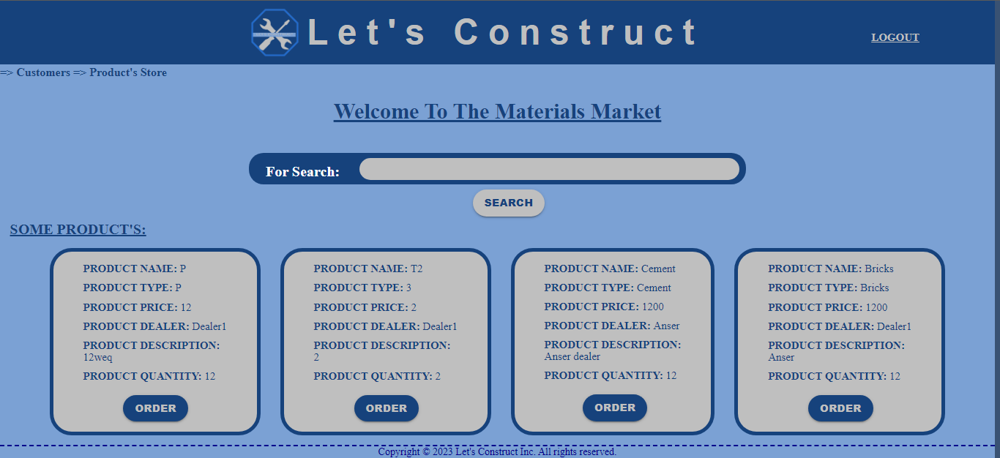 Searched Product: 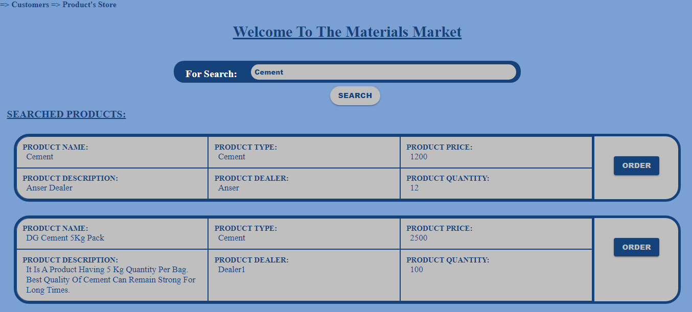

3) Worker's Subpages:
   1) SignIn/SignUp:
      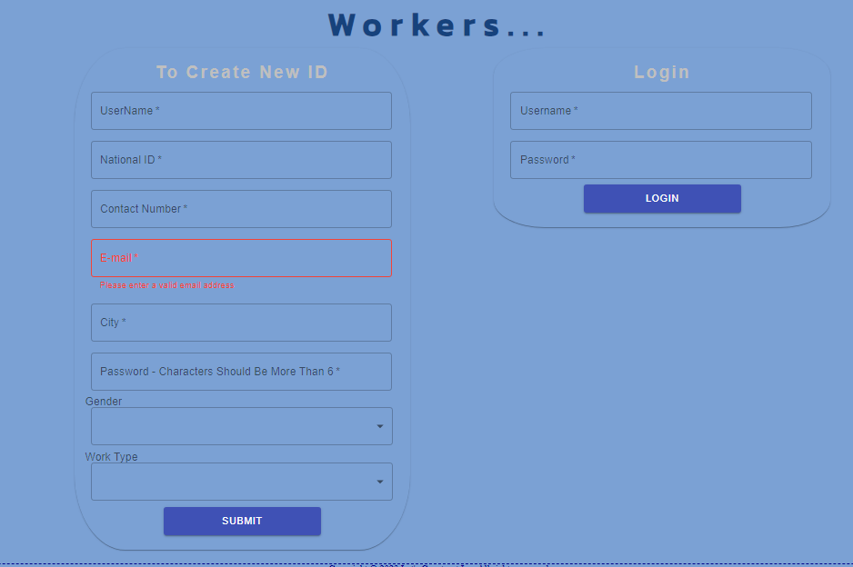
      
   3) Home Page:
      .png>)

4) Product-Dealer's Subpages:
   1) SignIn/SignUp:
      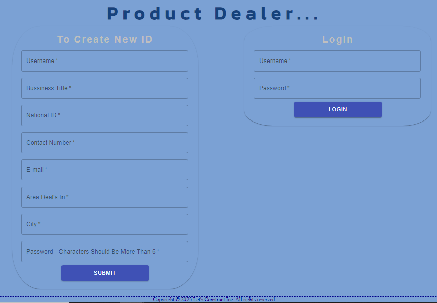
      
   3) Home Page:
      .png>)

      

   
